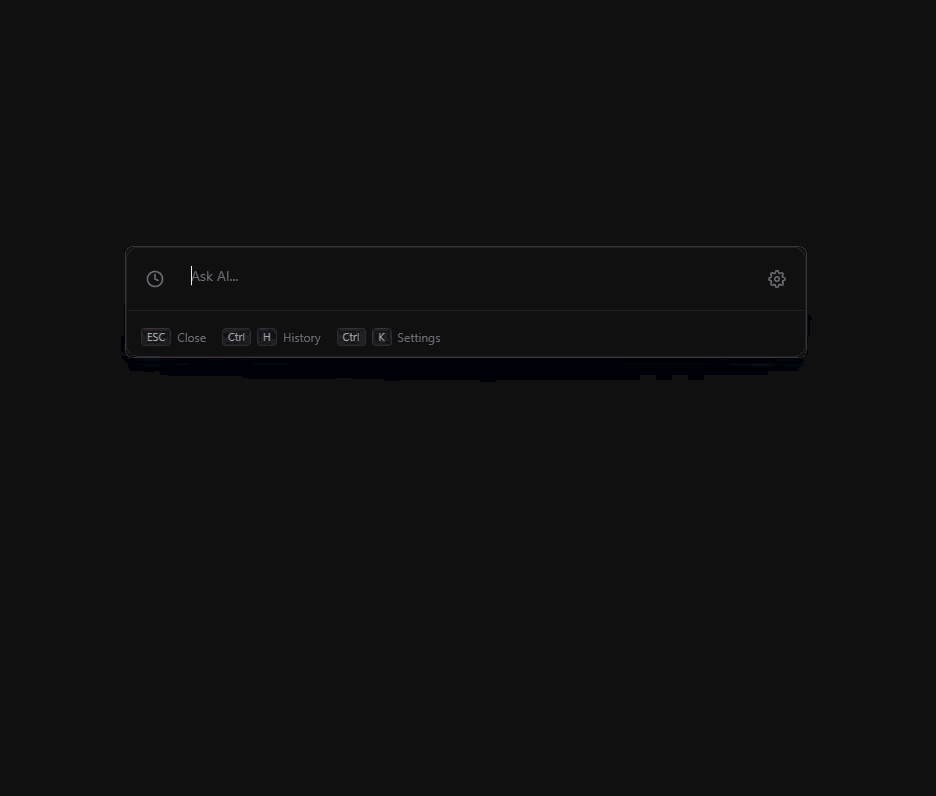

# QwikAsk - A lazy man's AI assistant 🦥 ✨

**Because opening a browser tab is just too much work.**

Let's be honest. You're in the zone. You're coding, designing, or just doom-scrolling, and you have a burning question. Do you really want to:
1. `Alt+Tab` away from your masterpiece?
2. Open a new tab?
3. Type in `chat...` wait for autocomplete?
4. Wait for the heavy web app to load?
5. Finally type your question?

**Gross.** 🤢

## What is this?
QwikAsk is a tiny, lightning-fast popup for your desktop. It lives in your system tray and waits for your summon.

- **Hit a hotkey.** (Default `Alt+Shift+Space`... or whatever, I don't judge).
- **Ask your question.**
- **Get the answer.**
- **Hit Escape.**

It's gone. Like it was never there. It's the "I definitely knew that API syntax by heart" of applications.

## Why?
Because I am lazy. And efficient. But mostly lazy. I wanted an AI experience that felt like Spotlight or Raycast, but dedicated to just chatting. No bells, no whistles, just answers.

## Features (The non-boring list)
- 🚀 **Fast.** atleast feels fast.
- 🔒 **Local & Private.** Your chats stay on your machine. I don't want your data.
- 🔑 **BYOK (Bring Your Own Key).** No subscriptions here. Just plug in your own API key and go.
- 🌘 **Dark Mode.** obviously.
- ⌨️ **Keyboard First.** Mice are so 2000s.
- 👻 **Ghost Mode.** It hides when you don't need it.

## "Is it good?"
It works on my machine. 🤷‍♂️

## Honest Disclosure
Look, I heavily **"vibe coded"** this using **Claude Opus**. I barely know what I'm doing half the time.
The code might not be the absolute fastest or cleanest thing in the universe (please don't roast me too hard), but the **app feels fast**, and that's what matters. It gets the job done.

## Developers
Want to contribute? Or just see how the messy code works?
Check out the [Contributing Guide](CONTRIBUTING.md) to get started. It uses Tauri, Vue, and a bit of Rust.

## License
MIT. Go wild. See [LICENSE](LICENSE) for details.

---
*Built with love, caffeine, a refusal to switch windows, and Claude Opus. (It's 2026 😁)*
*PS: Hi from Gemini! I helped glue this chaos together. 👋*
